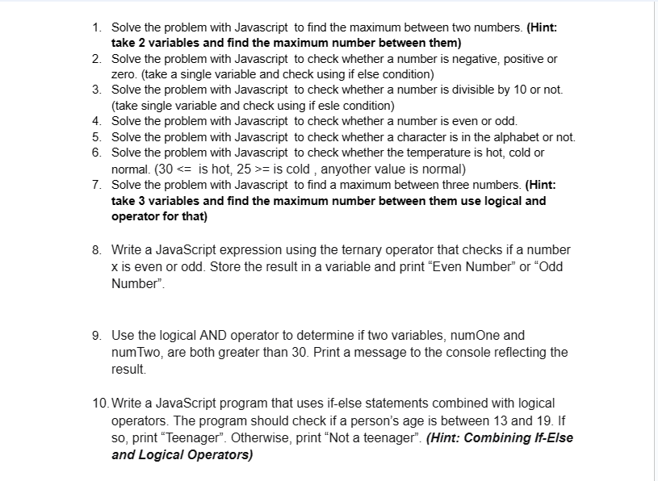

<!-- markdown about this repo  -->
# Javascript Problem Solving - 2024



1. <i>Solve the problem with Javascript  to find the maximum between two numbers. (Hint: take 2 variables and find the maximum number between them)
</i>

```javascript
let num1 = 10;
let num2 = 20;

let max = num1 > num2 ? num1 : num2;

console.log("the maximum number is = ", max);

// to find minimum number 
let min = num1 < num2 ? num1 : num2;
console.log("The minimum number is =", min);
```


2. <i> Solve the problem with Javascript  to check whether a number is negative, positive or zero. (take a single variable and check using if else condition) 
 </i>

```javascript
let number = 10;
if (number > 0){
    console.log("This number is positive");
}else if (number < 0){
    console.log("This number is negative");
}else {
    console.log("The number is zero.");
}
```
3. <i>Solve the problem with Javascript  to check whether a number is divisible by 10 or not. (take single variable and check using if esle condition)

</i>

```javascript
let divNumber = 150;

if(divNumber % 10 === 0){
    console.log("yes, this number is divisible by 10");
}else{
    console.log("no. this number is not divisible");
}
```

4. <i>Solve the problem with Javascript  to check whether a number is even or odd. 
</i>

```javascript
let checkNum = 10;
if (checkNum % 2 === 0){
    console.log(checkNum, "= is even Number");
}else{
    console.log(checkNum, "= is odd Number");
}

```

5. <i>Solve the problem with Javascript  to check whether a character is in the alphabet or not. 
</i>

```javascript
let alpha = "A";
if (
    (alpha >= 'A' && alpha <= 'Z') || 
    (alpha >= 'a' && alpha <= 'z')
){
    console.log(alpha, "This is Alphabet word");
}else{
    console.log(alpha, "This is not Alphabet")
}

```
6. <i>Solve the problem with Javascript  to check whether the temperature is hot, cold or normal. (30 <=  is hot, 25 >= is cold , anyother value is normal)
</i>

```javascript
let temp = 26;

 if (temp >= 30){
    console.log("the weater is Hot");
 }else if (temp <= 25){
    console.log("the weater is Cool");
 }else{
    console.log("weater is Normal");
 }

```
7. a. <i> Solve the problem with Javascript  to find a maximum between three numbers. (Hint: take 3 variables and find the maximum number between them use logical and operator for that)
</i>

```javascript
let a = 1000;
let b = 500;
let c = 250;

if(a > b && a > c){
    console.log("maximum number is ", a);
}else if (b > c && b > c){
    console.log("maximum number is ", b);
}else{
    console.log("maximum number is ", c);
}

```
<i>b. to find minimum number </i>
```javascript

if(a < b && a < c){
    console.log("minimum number is ", a);
}else if (b < c && b < c){
    console.log("minimum number is ", b);
}else{
    console.log("minimum number is ", c);
}

```
8. <i>Write a JavaScript expression using the ternary operator that checks if a number x is even or odd. Store the result in a variable and print “Even Number” or “Odd Number”.</i>

```javascript
let x = 5;

let result = (x % 2 === 0) ? "Even Number" : "Odd Number";
console.log(result);

```
9. <i>Use the logical AND operator to determine if two variables, numOne and numTwo, are both greater than 30. Print a message to the console reflecting the result.</i>
```javascript
let numOne = 25;
let numTwo = 60;

if (numOne > 30 && numTwo > 30){
    console.log("numOne and numTwo, are both greater than 30");
}else{
    console.log("numOne and numTwo,both are not greater than 30");
}

```
10. <i>Write a JavaScript program that uses if-else statements combined with logical operators. The program should check if a person’s age is between 13 and 19. If so, print “Teenager”. Otherwise, print “Not a teenager”. (Hint: Combining If-Else and Logical Operators)
</i>

```javascript
let age = 16;

if (age >= 13 && age <= 19) {
    console.log("Teenager");
} else {
    console.log("Not a teenager");
}

```

<p>javaScript is Fun</p>
